# 元学习

约一年前了解到元学习，特别喜欢这个idea，因为“让机器学会如何学习”打破了传统机器学习的训练思维，很符合现实中人的学习过程。近期想用它研究社交网络，看了许多从实验和理论角度解释元学习有效的文章，在此梳理一下加强记忆，也希望能对他人有帮助。内容主要参考李宏毅老师2020年机器学习课程，图片截自他的ppt或自己画的。

# 1 元学习介绍

## 1.1 为什么要用meta-learning

传统的机器学习和深度学习的模式是：获取目标领域的大量的样本数据来训练一个模型，若任务发生变化则需重新训练模型。这会带来两个问题，从数据方面看，机器模型的好坏很大程度上依赖于训练数据的规模和质量，正所谓”garbage in, garbage out”；从资源消耗上看，切换一个任务就得从头训练十分耗时耗力，当模型参数庞大更是无法忍受这样的计算成本。

一种广泛的解决办法是迁移学习，将源域的知识迁移到目标域。不过元学习或许提供了一种更为有效的方法，它力图让模型**获取一种“学会学习”的能力**，而不是只掌握单个领域知识。回想一下人类的学习，一个小孩仅看过几张苹果和梨子的照片，就能将它们与从未见过的水果区分开。受此启发，我们是否能让模型也只通过少量数据就学会新领域知识，具有快速学习的能力呢？这就是元学习的动机。

## 1.2 Meta learning概念

元学习又称“learn to learn”，**学习如何去学习**，目的是成为一个拥有学习能力的学霸，而不是背题家。机器学习通过数据$ D_{train}=\lbrace \mathbf{x, y} \rbrace $找一个函数$f^* $，希望$f^{* }(x) $尽可能接近真实标签y；元学习不直接学$f^* $，而是根据数据学一个函数$F$。如图1，函数$F$能寻找到对某任务最佳的函数$f^* $，即$f^* = F(D_{train})$，以描述特征和标签之间的关系。图2说明了$F$在元学习中流程中的位置，它是learnable的，比如模型网络结构、初始化参数和学习率等超参数，可用深度学习训练。总之，**meta learning想让机器学会自己设计网络结构等配置，减少人为定义。**
<div align=center>
    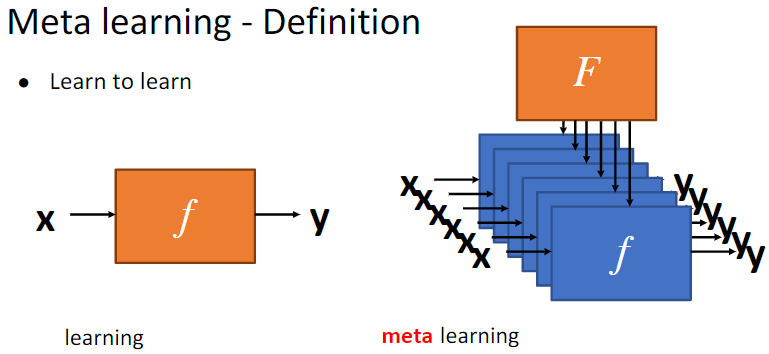 <br> 图1 机器学习 vs. 元学习定义
</div>
<br/>

分类：根据F要学习的组件类型，**元学习可主要分为三类**：基于度量的方法（metric-based），基于模型的方法（model-based），基于优化的方法（optimization-based）。其中应用最广，也最适合初学的当属基于优化的MAML。
<div align=center>
    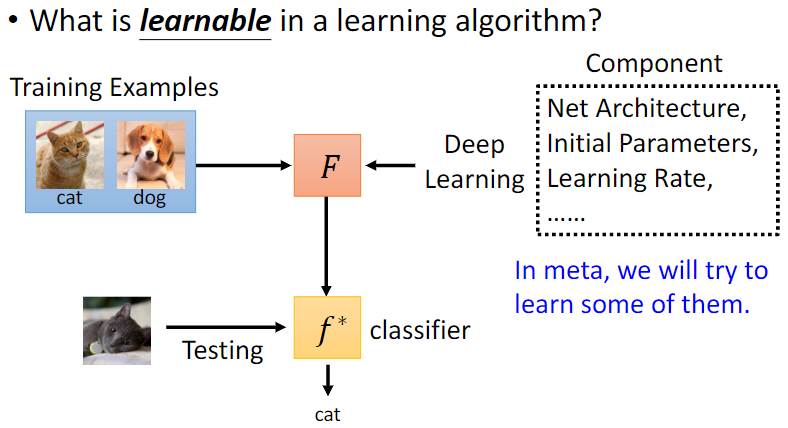 <br> 图2 元学习可学习的部件
</div>

# 2 元学习的建模过程——以MAML为例

## 2.1 MAML框架

权重初始化的好坏很大程度上影响模型的最终性能。  MAML（Model-Agnostic Meta-Learning）[[1]](https://www.notion.so/04d05292c1914a99bcef3e04668c0961) 是17年发表在ICML上的一种通用优化算法，适用于任何基于梯度学习的模型。它希望```"learning to initialize"``` ，为不同的任务提供初始化参数，以便面对新任务时能快速学习。

机器学习的数据分为训练集、验证集、测试集。训练过程一般经历三步：定义一系列函数f — 设计评价函数的好坏的指标（loss） — 挑选出最好的函数f*。如图，我们熟知的梯度下降法做图像分类的流程大致是：先定义一个网络结构$f_{\theta}$如CNN —> 初始化网络参数$\theta$ —> 输入第一个batch的训练数据，计算loss —> 计算梯度 —> 更新参数 —> 下一个batch训练 —> ……，训练完毕后得到最佳参数$\hat{\theta}$，对应最佳函数为$f^{* }$ 。

<div align=center>
    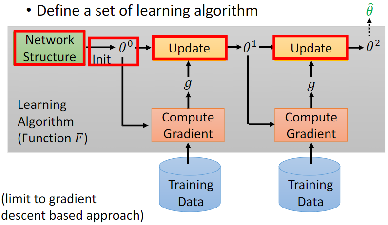 <br> 图3 机器学习更新参数过程
</div>

<div align=center>
    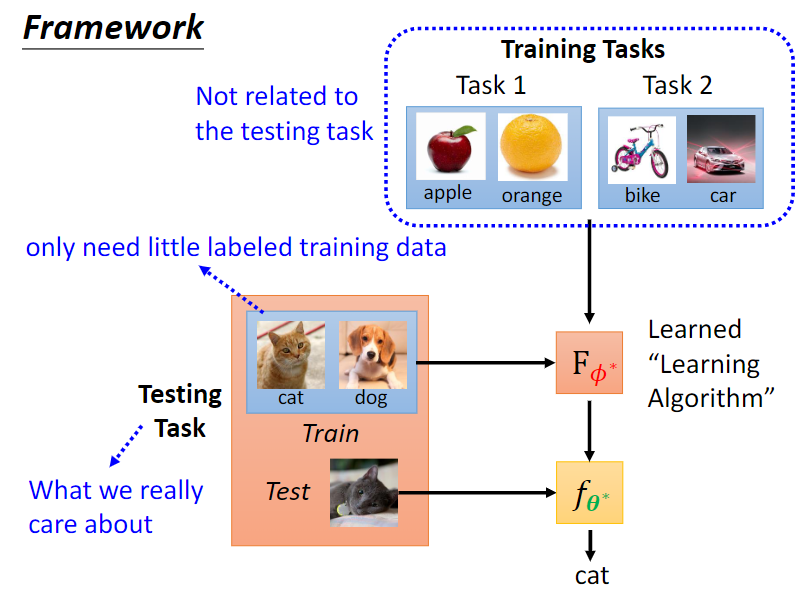 <br> 图4 元学习总体框架
</div>
<br/>

相比传统训练，元学习对数据的划分更有层次。它引入了task的概念，将数据装到一个个规模很小的task中，希望通过多次训练少量样本达到快速学习的目的。接下来介绍一些元学习的名词。元学习里的训练和测试阶段叫```meta-training```和```meta-testing```，其中的数据分别称为training tasks和testing tasks，也可以划分验证集即validation tasks。每一个task里又包含训练数据和测试数据，分别称为```support set```和```query set```。构建task时，```N-way，K-shot```指每个task中包含N个类别，每个类别下只有K个样本数据。如图是在做一个2-ways，1-shot的图像分类任务。一个```meta batch```包含meta_bsz个tasks，和机器学习的batch概念相似，批处理数据。3.2中会谈到batch和meta batch的区别。

<div align=center>
    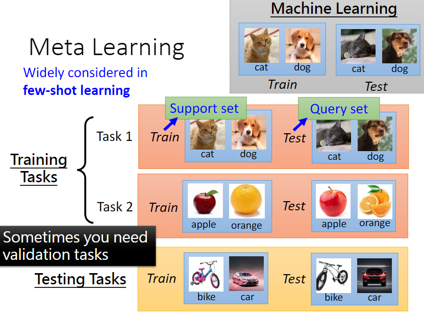 <br> 图5 元学习的数据以task为单位划分
</div>
<br/>

所以，元学习流程是：定义网络结构$F_{\phi}$，$f_{\theta}$—> 初始化网络参数$\phi$ —> 输入第一个**meta batch**的tasks—> 在task 1上的support set计算loss和梯度，更新参数$\theta$ —> 根据query set计算$l_1$—> 训练task2 —> …… —> 对第一个meta batch的所有loss求和，计算梯度，更新参数$\phi$ —> …… —> 所有meta batch训练完毕。

> 需要注意的是，因为MAML是学习模型的初始化参数，所以**元任务和子任务model strucure是一样的**。
> 

<div align=center>
    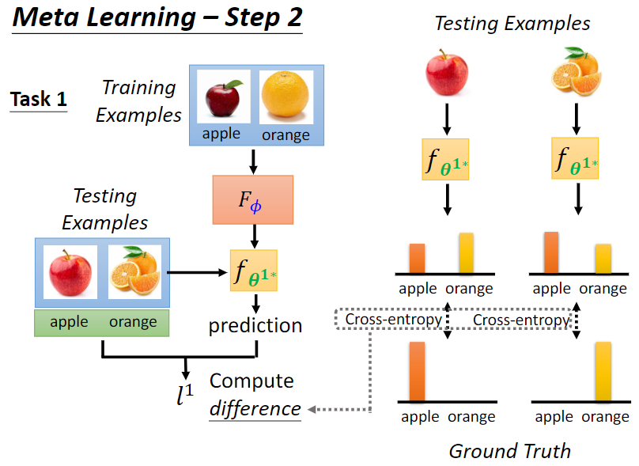 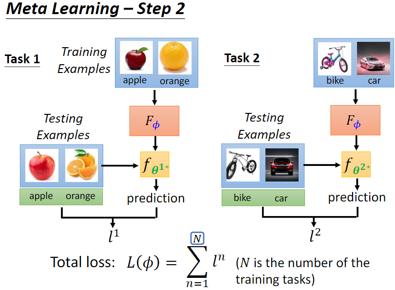 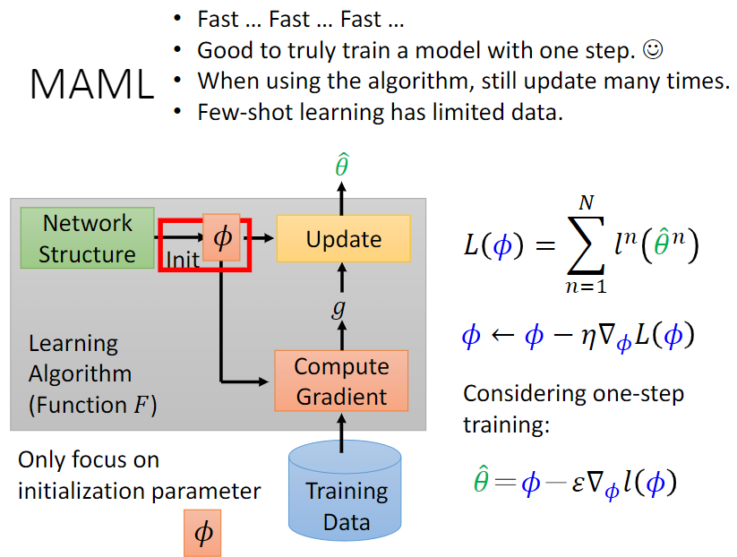 <br> 图6 元学习中task loss的计算和梯度更新
    </figure>
</div>

<!-- <div align=center>
       <br> 图7 MAML参数更新
</div> -->
<br/>
<div align=center>
    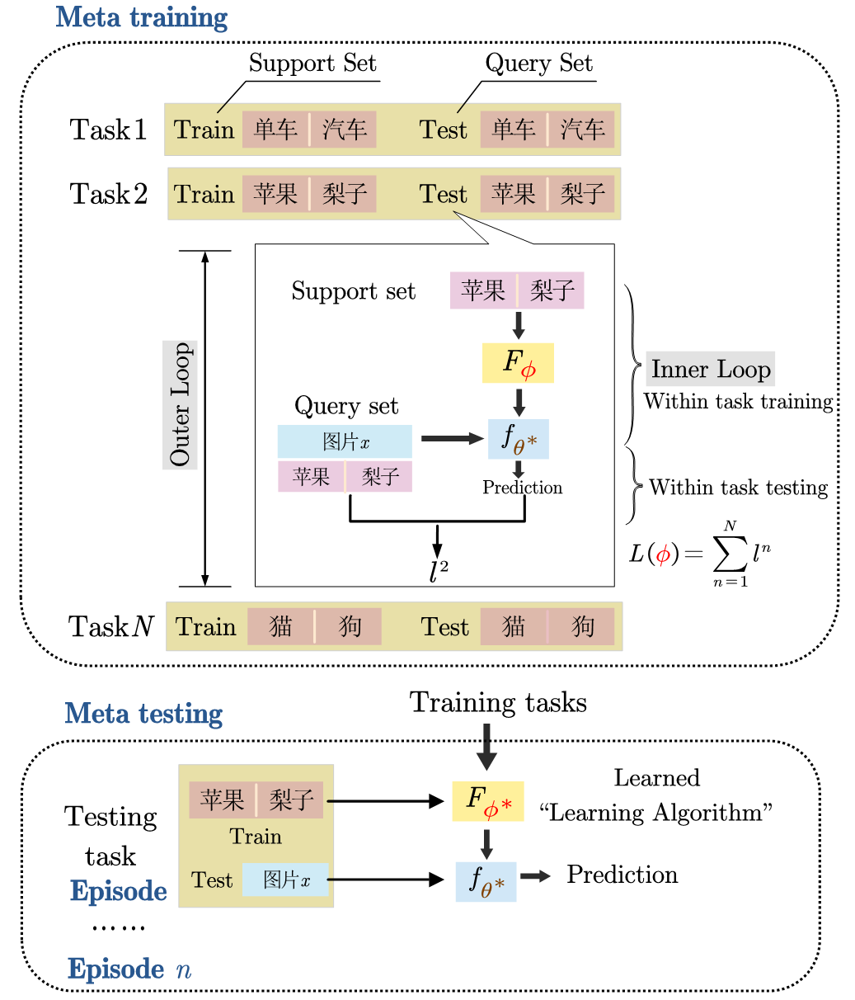   <br> 图7 元学习流程
</div>
<br/>

值得注意的是，**元学习与机器学习一个很大的不同是loss的计算**。如图，我们是先用training example（support set）的loss对任务网络的参数更新过一次后，再在testing examples（query set）上计算loss，用这些loss计算的梯度更新参数$\phi$，学到”learning algorithm“$F_{\phi^* }$，当要解决一个新任务时，F能得到对任务的合适函数f。而机器学习如预训练，是直接在训练数据上计算loss和梯度，学习函数f。

<div align=center>
    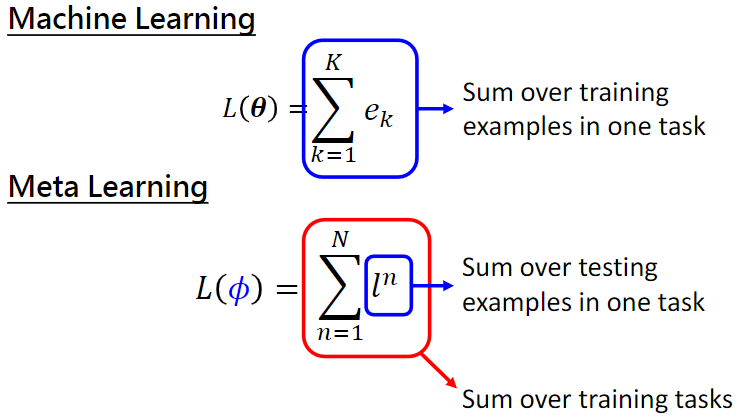   <br> 图8 机器学习与元学习的loss对比
</div>
<br/>

**在更新训练任务的网络时，只fine-tune了一步，然后更新meta网络。为什么是一步，可以是多步吗？**
> 可以多步，但李宏毅老师解释了MAML只更新一次的理由：  
> 1）只更新一次，速度比较快；因为meta learning中，子任务有很多，都更新很多次，训练时间比较久。
> 
> 2）MAML希望得到的初始化参数在新的任务中finetuning的时候效果好。如果只更新一次，就可以在新任务上获取很好的表现。把这件事情当成目标，可以使得meta网络参数训练更好（目标与需求一致） 
>  
> 3）具体应用时如果一次更新的效果真的不好，在测试的时候可以多更新（finetuning）几次  
> 
> 4）few-shot learning的数据很少，update多次容易过拟合

想入门元学习和MAML还是建议看李宏毅老师[ppt](https://speech.ee.ntu.edu.tw/~tlkagk/courses/ML_2019/Lecture/Meta1%20(v6).pdf)或视频课，更详细生动，很少看到比他讲得更好的老师了。我更想分享自己的理解和整合材料，所以这一part就到此啦。

## 2.2 Code实现

关于maml的实现，[原作者的代码](https://github.com/cbfinn/maml)基于TensorFlow。我当时是看李宏毅老师视频学的元学习，[课程网站](https://speech.ee.ntu.edu.tw/~hylee/ml/2020-spring.php)上有相应作业和参考代码，包括图片处理到task构造到MAML模型的完整流程，注释比较多还有助教讲解。适合入门元学习的实验有[regression](https://colab.research.google.com/drive/1MFJwRdOTefd6UOYRsNjdc7BWuB7Qe3lY)、[Omniglot图像分类](https://colab.research.google.com/drive/1OcF5TQCCd7WNK0cbXyzYxAzWpMKW_r8B)****。****如果想先快速run起来，[开源库learn2learn](https://github.com/learnables/learn2learn)是个不错的选择，不过如果想更深入的理解MAML还是建议看更底层代码。

```python
maml = l2l.algorithms.MAML(model, lr=0.1)
opt = torch.optim.SGD(maml.parameters(), lr=0.001)
for iteration in range(10):
    opt.zero_grad()
    task_model = maml.clone()  # torch.clone() for nn.Modules
    adaptation_loss = compute_loss(task_model)
    task_model.adapt(adaptation_loss)  # computes gradient, update task_model in-place
    evaluation_loss = compute_loss(task_model)
    evaluation_loss.backward()  # gradients w.r.t. maml.parameters()
    opt.step()
```

## 2.3 对比

元学习多用在few shot和zero shot场景，在解决小样本问题上还有很多其他技术方法。与元学习概念相似的名词也很多，如迁移学习和多任务学习，刚开始接触时我很难分清它们的区别，在此做个总结。

```迁移学习```（tansfer learning）：运用已有领域学到的知识来辅助新环境中的学习任务。新兴领域往往缺少大量训练数据，直接从头训练成本太高，而相关领域的知识学习是相似的，因此我们可以运用已有的相关知识（source domain）迁移到新的学习任务（target domain）上。比如一个人学了java，那么可以类比着尽快学会python。

```多任务学习```（multi-task learning）：需要将多个任务同时学好。我们常见的机器学习方式是单任务学习与之相对，只做动物图像分类或人脸识别。而现实生活中的学习任务是有内在联系的，部分知识可以共享，例如，一位跳高运动员不仅要了解如何跳更高，还需涉及助跑，降落姿态等相关子任务内容。

> 以上两个概念和元学习的相似之处是都利用了相似任务帮助提升泛化能力。不同之处在：迁移学习要求source domain和target domain具有相关性，否则可能会出现”negative transfer“的现象，将在电影上学到文学知识迁移到物理的学习上显然不妥。多任务学习也要求任务之间有相关性，子任务是同时训练的，因此能发掘任务间的关联和差别，起到互相促进作用。如计算机408的四门学科，计算机组成原理的知识对操作系统的学习也会有帮助。
> 

而元学习和它俩的差别一是任务粒度更细，二是loss的设计更关注未来的”潜力“，而不是当前在训练数据上的表现。李宏毅老师用两张直观的图说明了迁移学习中model pre-training和meta learning的区别。可以看出，用预训练的参数初始化后续模型，难以使所有task的loss都达到最低点，**当下训练好**并不保证后续表现仍好；若用元学习，虽然它学到的参数在当前训练任务不是最佳，在子任务上微调后，都达到了各自任务的局部最优，有更**强潜力**。


<div align=center>
    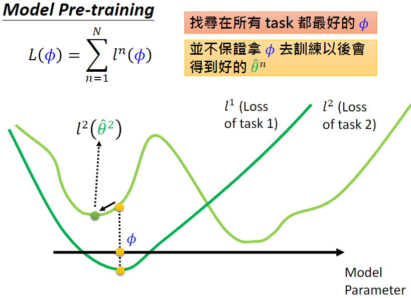 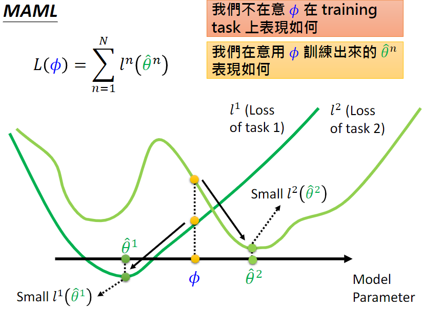  <br> 图9 预训练在当下表现好，元学习更注重在未来表现
</div>

# 三 Deeper insight

## 3.1 类比人的学习

个人很喜欢元学习的一个原因是，我能将其与自己以往的学习经历结合，理解它的理念，直觉上感受它有效的原因。举个熟知的例子——高考，想想高中我们是如何在3年里快速掌握多门学科知识，提高学习能力的。最常见的高考模式要求考生的总分越高越好，数学满分但单科成绩落后并不是我们所期望的。那平时我们是怎么学习的呢？主要是自我练习+单元测验。平日里，学生会自己刷练习题，对比标准答案。每隔一段时间，会有班级的单元测验或月考，考察学生对新知识的掌握情况。你细品，元学习是不是和人类快速学习新知识的步骤有相似之处。

以3-ways 5-shot图像分类任务为例，每个meta batch大小meta_bsz=8。首先，目标是要在meta testing上取得高性能（高考总分高），testing data包含混杂类别的图像（高考题有语数英等七个学科题目）。第二，在元训练阶段，对于每一个task（随机抽取3门学科各5 * 2道题），$\phi$先用support set微调出适应该任务的参数$\theta$（先写数学练习题找到”题感“），再在query set上计算loss（单元测验还错的题）。将一个meta batch内8个tasks在query set上的loss求和（所有测验的错题），计算梯度来更新$\phi$（从测验的错题中学习，改正）。利用梯度下降法，loss会越来越低（测试错得越少），最终模型通过元学习获得了快速学习能力。

可以看出，support set相当于平时自学做的练习题，而query set则是单元测试（往往是平时练习题的变形，表面不同但底层知识相似）。比如现在小明小红都想快速学会余弦函数的知识点，但仅已知10道余弦函数的题目及答案，怎么做到呢？小红机智地先对题目分门别类，5道当练习，5道当自我测试。结合以前的知识，她会去学习如何从题目已知信息得到正确答案。然而，她从练习中总结的规律未必是正确的，若她能在测试题上做对，我们才有理由相信她可能掌握了新知识，若平时练习过的题在测试时还错，说明做错的知识点需特别加强，这是许多学霸的自学方式。另一种做法接近机器学习的流程，小明直接从10道题中总结规律，他也许学会或背会了这10道题，但我们很难判断他是否真正掌握了知识，如果直接上考场有极大概率翻车。这就好比在分辨牛和狗的图片时，模型是根据背景为绿色的草来判断图片为牛，而不是识别出了动物本身的特征，因此背景一旦更换模型就失效了。

<div align=center>
    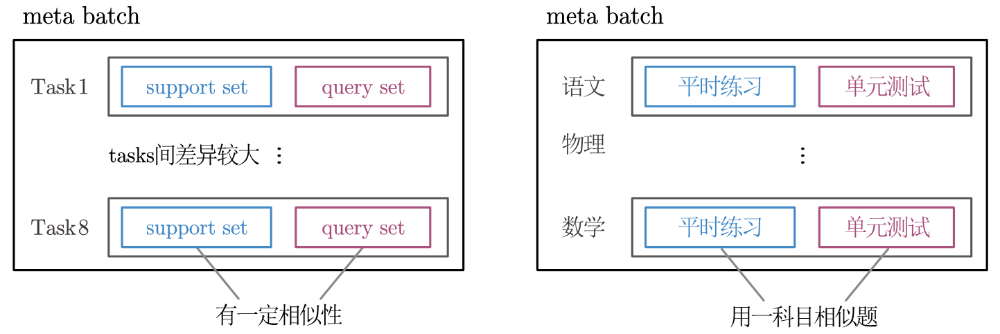 <br> 图10 元学习和人类学习的类比
</div>

## 3.2 学习能力如何获得

对比MAML和人类自学的流程，我认为MAML在”学会学习“的设计上有两个聪明之处（讲错了别打我，欢迎讨论><）

1）将机器学习的batches划分成若干tasks，tasks的构建

机器学习训练和更新参数的单位是batch，而元学习是在若干个数据量很小的task上训练，以meta batch为单位更新meta网络参数，task内会适应任务fine-tune子网络参数。虽然batch也能缩小size来达到和task相似的概念，但它俩最大的不同是**batch的数量内的数据是混杂的，而task的构建是有讲究的**！**task内的数据类别要比较相似，”learn to compare“**，经验上也是字形相近的单词一起记相比单词和数学公式糅杂记忆的效果更好。而一个元batch的**tasks间涉及的知识可以多样一些**，比如tasks全是中文英语法语等语言类，可能会使我们有了快速掌握新语言的学习能力，但数学类的学习能力很差，这并不是我们期待的全能型learner。

2）query set提供了检验学习能力的机会

元学习和机器学习的很大不同是，在task内再将数据划分成了support set 和 query set，其实或许training examples和testing examples 这两个名词能更好地解释设置它们的本来目的（可能怕和机器学习里的train和test混淆）。上一小节将query set类比成了单元测试，这看起来是合乎常识的，让模型从support set中找寻规律知识，再在query set上检验模型是否学到的是本质知识。如果模型仅学到了表面知识，如绿色背景的草地，那么在query set的表现就会很差，之后的task训练中它可能会思考怎样才能学到关键的核心知识，这个过程就好似人类的学习，学习能力也是在这样的反复检验中习得的。

## 3.3 maml训练注意的问题

接下来总结我目前从文献和实验中感受到的经验。

1. task内的样本数据要相似，一个meta batch内的tasks最好具有一定差异性。
2. task内的support set和query set需要有一定关联（底层知识相似），可以不一样也可以完全一样。

目前了解到task的划分有两种方式：support set和query set**不一样称为train-validation**，**一样的称为train-train**。在实践中，不同划分对训练结果的影响不同，具体可参见[[2]](https://www.notion.so/04d05292c1914a99bcef3e04668c0961)[[3]](https://www.notion.so/04d05292c1914a99bcef3e04668c0961)

总的来说，元学习是想成为一个better learner，fit more quickly，很适合只有少量数据但想拟合更好的few-shot场景。下面的表情包完美表达我的感受，真香现场hhh。

<div align=center>
    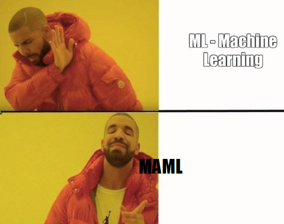
</div>

以上就是元学习的概念和MAML介绍啦~ 主要想分享我是怎么联系以往经历理解元学习的，这样会更深刻，生活化的理解反过来也帮助我做一些直觉推断。元学习还有很多有意思的内容，比如有效性的理论分析、元学习task增强、样本不均衡的元学习等，希望自己能坚持写下去~

# 参考文献

1. Finn, Chelsea, Pieter Abbeel, and Sergey Levine. "Model-agnostic meta-learning for fast adaptation of deep networks." *International conference on machine learning*. PMLR, 2017.
2. Bai, Yu, et al. "How Important is the Train-Validation Split in Meta-Learning?." *International Conference on Machine Learning*. PMLR, 2021.
3. Saunshi, Nikunj, Arushi Gupta, and Wei Hu. "A Representation Learning Perspective on the Importance of Train-Validation Splitting in Meta-Learning." *International Conference on Machine Learning*. PMLR, 2021.
4. [https://speech.ee.ntu.edu.tw/~tlkagk/courses/ML_2019/Lecture/Meta1 (v6).pdf](https://speech.ee.ntu.edu.tw/~tlkagk/courses/ML_2019/Lecture/Meta1%20(v6).pdf)
5. [https://github.com/learnables/learn2learn](https://github.com/learnables/learn2learn)
6. [https://zhuanlan.zhihu.com/p/136975128](https://zhuanlan.zhihu.com/p/136975128)
